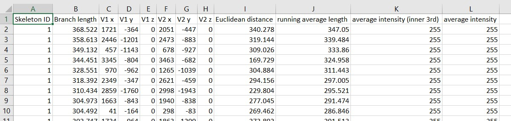
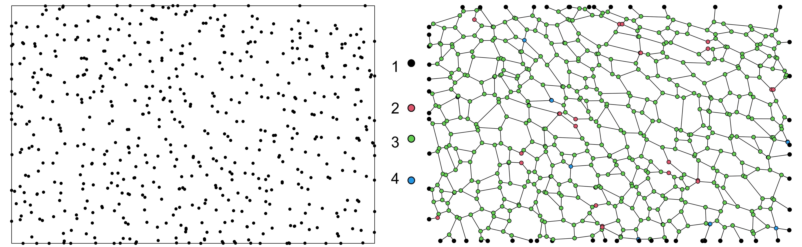
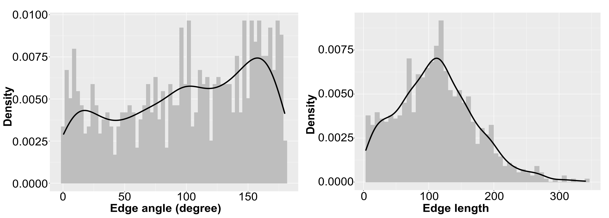

```{r include=FALSE}
knitr::opts_chunk$set(out.width = 10)
```

# Introduction

We describe a generative network model of the architecture of the enteric nervous system (ENS) in the colon that can work on the data from images of human and mouse tissue samples obtained through confocal microscopy.

## Libraries and software versions

We use an open source image processing package Fiji [@schindelin2012fiji] based on ImageJ2 for processing the ENS microscopy images and extracting data from them. Afterwards, we analyze the ENS ganglia and ganglionic neurons as point patterns and the ENS network as linear network or graph objects. We use R libraries *spatstat* and *igraph* for this purpose, along with other necessary libraries. In our experiments we used *Fiji v1.53h* and *R version 4.0.2* in RStudio. We divide the entire generative modeling process into a few steps and guide through the R functions implementing those steps with a working example below.

```{r eval=FALSE}
load_lib = c("deldir", "spatstat", "magrittr", "dplyr", "igraph", "scales", "httr", 
             "tidyverse", "ggnetwork", "ggplot2", "poweRlaw", "imager", "viridis", 
             "plotrix", "openxlsx", "tidyr", "spdep", "maptools", "tmap", "OpenImageR", 
             "dismo", "lctools", "officer", "rvg", "truncnorm", "emdist", "ks", "rlist", 
             "readxl", "OneR", "MASS", "RColorBrewer")

install_lib = load_lib[!load_lib %in% installed.packages()]
for(lib in install_lib) install.packages(lib, dependencies=TRUE)
sapply(load_lib, require, character=TRUE)
```

# Segmenting ENS image

We have the ENS microscopy images in *.tif* format with 3 color channels. We process the *.tif* image in Fiji and extract numerical information that can be used in subsequent analyses. The extracted information contain the 2D coordinates of the end vertices of the ENS network, the network branch (edge) lengths (actual and Euclidean) etc. All distances are measured in microns. We describe the image processing steps done in Fiji for segmenting the ENS images here. Note that, the parameter values mentioned here for different filters are subjected to change. We tried to tune them to the values that worked for our images mostly. 

* We load the *.tif* image into Fiji and flatten it. *Images > Overlay > Flatten*.

* We set the appropriate pixel to micron scale in *Analyze > Set Scale*.

* If the entire image is not ideal for analysis, we crop out the region of interest (ROI) and make it an 8-bit image. *Images > Type > 8-bit*.

* Despeckle. *Process > Noise > Despeckle*. Subtract Background with rolling ball radius 50 pixels. *Process > Subtract Background...*

* Enhance local contrast with block size 199. *Process > Enhance Local Contrast (CLAHE)*. This step can take a few moments.

* We apply the fast Fourier transformation (FFT) based bandpass filter with large structures down to 150 pixels and small structures up to 50 pixels. *Process > FFT > Bandpass Filter*.

* At this point, we need to include an additional plugin to Fiji called MorphoLibJ. You may need to download its *.jar* to the Fiji plugins folder. Check out the source on git (https://github.com/ijpb/MorphoLibJ). *Plugins > MorphoLibJ > Segmentation > Morphological Segmentation*. We run the process with Input Image *Border Image* and Watershed Segmentation tolerance 20. This step can take a few moments. We create image with Watershed Lines. This gives us the segmented image of the ENS network.

* We set the settings to Black Background in *Process > Binary > Options...* and invert the image. *Edit > Invert*.

* *Analyze > Skeleton > Analyze Skeleton* gives us a table named *Branch information* with all the extracted numerical information about the ENS network that we need. We save this table in *.csv* format. Remember that, Fiji processes the images considering the top-left corner as the origin. So, before using the extracted coordinates in R codes, you MUST negate the y-coordinates, otherwise you will get a vertically flipped image.

{}

{}

# Analyzing ENS characteristics

## Constructing suitable data structures

We construct a few suitable data structures to store the ENS network information extracted from the images, that will be useful in the subsequent stages of the code. The function *constructDataStruct* takes as input the full path to the *.csv* file that has the ENS network information (*branch_info_path*), and returns a dataframe object (*branch_all*), a point pattern object (*branch_ppp*), a point pattern on a linear network object (*branch_lpp*) and a graph object (*g1*). Note that, if you store the ENS network information in any format other than *.csv* (i.e. *.xlsx*), do not forget to modify the corresponding line in following code segment accordingly. 

```{r eval=FALSE}

constructDataStruct <- function(branch_info_path){

  branch = data.frame()
  branch = read.csv(branch_info_path) # change here if needed.
  
  # removing the branches with length 1 (too small)
  branch_adj = branch[which(branch$Branch.length!=1),]
  
  # constructing a dataframe with the branch ends (vertices). 
  # consider y coordinates are negated beforehand.
  branch_sim = data.frame(x1=branch_adj$V1.x, y1=branch_adj$V1.y, x2=branch_adj$V2.x, 
                          y2=branch_adj$V2.y)
  
  # removing duplicate branches
  temp = which(branch_sim[,1]!=branch_sim[,3] &  branch_sim[,2]!=branch_sim[,4])
  branch_sim = branch_sim[temp,]
  
  # creating a unique id for each of the branches so we can find the vertices
  branch_id = matrix(data=factor(as.numeric(as.matrix(branch_sim))), ncol=4)
  branch_id = data.frame(P1=paste(branch_id[,1],"-",branch_id[,2], sep=""), 
                         P2=paste(branch_id[,3],"-",branch_id[,4], sep=""))
  branch_id = c(as.matrix(branch_id)) %>% factor() #%>% unclass()
  levels(branch_id)  = 1:length(levels(branch_id))
  branch_id = data.frame(matrix(ncol=2, data=unclass(branch_id)))
  
  # putting together all info and extract position of all the vertices
  branch_all = data.frame(branch_sim, branch_id); colnames(branch_all) <- 
    c("x1","y1","x2","y2","n1","n2")
  
  branch_xy = data.frame(x=c(branch_all$x1, branch_all$x2), 
                         y=c(branch_all$y1, branch_all$y2), 
                         n =c(branch_all$n1, branch_all$n2) )
  branch_xy = distinct(branch_xy)
  
  # ordering by the vertex number
  branch_xy_ord = branch_xy[order(branch_xy$n),]
  
  # creating point and line patterns
  
  # creating a point pattern
  branch_ppp = ppp(x=branch_xy_ord$x, y=branch_xy_ord$y, 
                   window=owin(xrange=c(min(branch_xy_ord$x), max(branch_xy_ord$x)), 
                               yrange=c(min(branch_xy_ord$y), max(branch_xy_ord$y))))
  branch_ppp = unique.ppp(branch_ppp)
  # plot the point pattern
  plot(branch_ppp, cex=1, pch=20, main="", bg=1)
  
  # creating a line pattern
  branch_lin = linnet(branch_ppp, edges=as.matrix(branch_all[,5:6]))
  # plot the branches
  plot(branch_lin, add=T)
  
  # creating the graph representation
  g1  = graph_from_data_frame(branch_all[,5:6], directed=FALSE)
  
  # creating a list representing degree for every vertex and use it in the point pattern
  degs = (degree(g1))
  ord = order(as.numeric(names(degs)))
  degs = degs[ord]
  
  # COMMENT IN THE NEXT TWO LINES IF REQUIRED
  # including the degree of the vertices as mark in the point pattern
  # marks(branch_ppp) = factor(degs)
  # branch_ppp$markformat = "factor"

  # creating point pattern on linear network to store the information
  branch_lpp = lpp(branch_ppp, branch_lin )
  
  return(list(branch_all, branch_ppp, branch_lpp, g1))
}

```

{}

## Summary statistics

To understand the spatial organization of a point pattern, summary statistics such as - G, F, J, K, L functions are quite useful. The following function *summaryStat* demonstrates the L-function analysis for a given ENS ganglia point pattern. The other summary statistics functions can be analyzed in the exact same manner. The function *summaryStat* takes as input the full path to the *.csv* file that has the ENS network information (*branch_info_path*), and plots the corresponding L-function statistics as output.

```{r eval=FALSE}
summaryStat <- function(branch_info_path){
  # constructing suitable data structures
  data_struct_list = constructDataStruct(branch_info_path)
  
  branch_all = data_struct_list[[1]]
  branch_ppp = data_struct_list[[2]]
  branch_lpp = data_struct_list[[3]]
  g1 = data_struct_list[[4]]
  
  # computing L-function statistics and plotting with complete spatial randomness (CSR) 
  # for comparison
  ltest= envelope(branch_ppp, Lest)
  ggplot(data = ltest, aes(r)) + 
    
    geom_ribbon(aes(ymin=lo-r, ymax=hi-r), alpha = 0.3)+
    geom_line(aes(y=lo-r, colour="csr lower bound"), size=2) +
    geom_line(aes(y=hi-r, colour="csr upper bound"), size=2) +
    
    geom_line(aes(y=obs-r, colour="observed"), size=2) + 
    
    theme(legend.position="top", plot.title = element_text(hjust = 0.5, size=20), 
          legend.title=element_blank(), legend.text=element_text(size=30),
          axis.text.x = element_text(size = 30), axis.text.y = element_text(size = 30),
          axis.title.x = element_text(size = 30), axis.title.y = element_text(size = 30)) + 
          xlab("Distance") + ylab("L Function")
}
```

{}

In the observed L-function plot, the shaded area represents complete spatial randomness (CSR), and the region below and above 0 represents spatial inhibition and attraction respectively. 

## Analyzing ENS ganglia

We fit the ENS ganglia point pattern to inhomogeneous hardcore-Strauss process. The function *analyzeGanglia* takes as input the full path to the *.csv* file that has the ENS network information (*branch_info_path*), and returns the fitted model (*ganglia_model*) along with its parameters: intensity (*Beta*), interaction parameter (*Gamma*), interaction distance (*R*), hardcore distance (*H*) and point pattern window (*window*).

The function *spatstat::ppm* takes the *interaction* parameter, where we need to provide *StraussHard()* with an interaction distance of our preference. In the case of hardcore-Strauss process, interaction distance *R* and interaction parameter *Gamma* are irregular parameters, which can be determined by biological knowledge or by analyzing the profile Akaike information criterion (AIC) of the point pattern for a range of irregular parameters (See [@baddeley2015spatial] Chapter 13.6.3 for details).

```{r eval=FALSE}

analyzeGanglia <- function(branch_info_path){
  data_struct_list = constructDataStruct(branch_info_path)
  
  branch_all = data_struct_list[[1]]
  branch_ppp = data_struct_list[[2]]
  branch_lpp = data_struct_list[[3]]
  g1 = data_struct_list[[4]]
  
  # checking the summary of the point pattern
  print(summary(branch_ppp))
  
  # figuring out R
  # ltest = envelope(branch_ppp, Lest, nsim=39)
  # from = min(nndist(branch_ppp))
  # to = max(ltest$r)
  # 
  # range_R = data.frame(r=seq(from, to, by=0.05))
  # p = profilepl(s=range_R, f=StraussHard, branch_ppp~x+y, aic=TRUE, rbord = from)
  # ganglia_model = as.ppm(p)

  # approach without AIC analysis
  # fitting hardcore-Strauss model and extracting parameters
  # provide the correct parameter to StraussHard function
  ganglia_model = ppm(branch_ppp ~ x+y, interaction = StraussHard(220.40)) 
  
  param_model = rmhmodel(ganglia_model)
  Beta = param_model$par$beta
  Gamma = param_model$par$gamma
  R = param_model$par$r
  H = param_model$par$hc
  window = branch_ppp$window

  return(list(Beta, Gamma, R, H, window, ganglia_model))
}

```

## Analyzing ENS network

We analyze the ENS network under consideration to figure out its structural characteristics, which is very crucial for the next step in modeling - generating ENS network on top of a simulated point pattern instance. We focus on the degree of the vertices, the angle (in degree) and the length of the edges. The function *analyzeBranch* computes these characteristics values for the given ENS network and constructs their kernel density estimates. It takes as input the full path to the *.csv* file that has the ENS network information (*branch_info_path*), and returns a dataframe object (*branch_all*) containing all the feature values for each of the edges of the ENS network, three kernel density estimates (*orgKDE_angle*, *orgKDE_length* and *orgKDE_both*) containing the kernel density estimates of the edge angle, edge length and both of the given ENS network respectively, meshedness, compactness and density of the given ENS network (*meshedness*, *compactness*, *network_density*). The function *analyzeBranch*  uses a few helping functions that are also included below.

```{r eval=FALSE}

analyzeBranch <- function(branch_info_path){
  data_struct_list = constructDataStruct(branch_info_path)
  
  branch_all = data_struct_list[[1]]
  branch_ppp = data_struct_list[[2]]
  branch_lpp = data_struct_list[[3]]
  g1 = data_struct_list[[4]]
  
  # plotting the ENS network
  par(mar=c(0,0,0,0), oma=c(0,0,0,0))
  plot(branch_lpp, main="", pch=21, cex=1)
  
  # extracting information about connectivity
  table_degree = table(degree(g1))
  degree_frame = as.data.frame(degree(g1))
  colnames(degree_frame)[colnames(degree_frame) == 'degree(g1)'] = 'deg'
  
  ggplot(degree_frame, aes(x=deg)) + 
    geom_histogram(aes(y=..density..), colour="grey", fill="grey", binwidth = 0.5)+ 
    geom_density(alpha=1, colour="black", size=1.5) +
    scale_x_continuous(limits=c(0, 10), breaks = seq(0,10, by=1))+
    labs(x = "Degree of the vertices", y = "Density", color = "")
  
  # clustering coeff
  # Transitivity measures the probability that the adjacent vertices of a vertex are 
  # connected. This is sometimes also called the clustering coefficient.
  cluster_coeff = transitivity(g1, type = "global")

  # calculating the edge angle (in degree) and plotting the distribution
  branch_all$angle = (apply(branch_all, 1, function(x) calcAngle(x)))
  ggplot(branch_all, aes(x=angle)) + 
    geom_histogram(aes(y=..density..), colour="grey", fill="grey", binwidth = 3)+
    geom_density(alpha=1, colour="black", size=1.5) +
     labs(x = "Edge angle", y = "Density", color = "")
  
  # calculating the edge length and plotting the distribution
  branch_all$euclid = (apply(branch_all, 1, function(x) calcDist(x)))
  ggplot(branch_all, aes(x=euclid)) + 
    geom_histogram(aes(y=..density..), colour="grey", fill="grey", binwidth = 7)+
    geom_density(alpha=1, colour="black", size=1.5) +
     labs(x = "Edge length (Euclidean)", y = "Density", color = "")

  # visualize the bivariate distribution of edge angle and length of an original network
  den3d = kde2d(branch_all$angle, branch_all$euclid)
  persp(den3d, theta = -45, phi = 30, xlab="Edge angle", ylab="Edge length",
        ticktype = "detailed", shade = 0.75, col="lightblue")
  
  # computing some network characteristics: meshedness, density and compactness
  N = branch_ppp$n
  E = length(branch_all$x1)
  A = (branch_ppp$window$xrange[2]-branch_ppp$window$xrange[1])*
    (branch_ppp$window$yrange[2]-branch_ppp$window$yrange[1])
  L = sum(branch_all$euclid)
  
  meshedness = (E-N+1)/((2*N)-5)
  network_density = E/((3*N)-6)
  compactness = 1- ((4*A)/(L-(2*sqrt(A)))^2)
  
  # assigning some weight to each edge of the ENS network based on the degree of its 
  # two end vertices, this weight will be helpful in the network generation stage
  branch_all$weight = apply(branch_all, 1, function(x) computeEdgeWeight(degree(g1), x))
  branch_all$weight = range01(branch_all$weight)
  
  data = branch_all[, 7:9] # column 7 has angle, 8 has length, 9 has weight
  # computing the kernel density estimates
  orgKDE_angle = computeKDE(data, 1) # 1: angle, 2: length, 3: both
  orgKDE_length = computeKDE(data, 2) # 1: angle, 2: length, 3: both
  orgKDE_both = computeKDE(data, 3) # 1: angle, 2: length, 3: both
  
  return(list(branch_all, orgKDE_angle, orgKDE_length, orgKDE_both, meshedness, 
              network_density, compactness))

}

```

The function *range01* simply 0-1 normalizes a given vector.

```{r eval=FALSE}
range01 <- function(x){(x-min(x))/(max(x)-min(x))}
```

The function *calcAngle* computes the angle of an edge with the horizontal x axis in degree. The input parameter *x* has four components - the coordinates of the end points of the edge *x1*, *y1*, *x2*, *y2*.

```{r eval=FALSE}
calcAngle <- function(x){
  nom = x[4]-x[2]
  denom = x[3]-x[1]
  angle = as.numeric(atan(nom/denom))*180/pi
  
  return((angle) %% 180)
}
```

The function *calcDist* computes the Euclidean distance between the two nodes of an edge. The input parameter *x* has four components - the coordinates of the end points of the edge *x1*, *y1*, *x2*, *y2*.

```{r eval=FALSE}
calcDist <- function(x){
  return(sqrt( ((x[1]-x[3])^2) + ((x[2]-x[4])^2) ) )
}
```

The function *computeKDE* computes the distribution of angle and/or length of the ENS network. It takes as input a matrix *data* with column 1 that has the angle and column 2 that has the length of the edges, and an integer *mode* that is either 1/2/3 (1 for angle, 2 for length, 3 for both).

```{r eval=FALSE}
computeKDE <- function(data, mode){
  if(mode == 1){
    data = as.matrix(data[, 1])
    return(kde(x=data))
  }
  if(mode == 2){
    data = as.matrix(data[, 2])
    return(kde(x=data))
  }
  if(mode == 3){
    data = as.matrix(data[, 1:2])
    return(kde(x=data))
  }
}
```

The function *computeEdgeWeight* assigns a weight to each edge of the ENS network based on the degree of its two end vertices.

```{r eval=FALSE}
computeEdgeWeight <- function(g2_degree, x){
  return(g2_degree[x[5]] + g2_degree[x[6]])
}
```

{}

# Generating ganglia centers

While analyzing the ENS ganglia, we fitted the ganglia point point pattern to a hardcore-Strauss process. Given that fitted model or the parameters of the model, the following function *generateGangliaCenters* can generate simulated realizations of ENS ganglia centers. If the parameter *with_model=1*, the function generates ganglia centers directly from the model. If *with_model=0*, it depends on the value of the parameter *process_type* in generating ganglia centers from either of basic hardcore, basic Strauss or hardcore-Strauss process with their required parameters. Finally, the function returns the simulated realization as a point pattern object.

```{r eval=FALSE}

generateGangliaCenters <- function(intensity, interaction, interact_radius, hardcore_dist, 
                                   window, process_type=3, with_model=0, fitted_model){
  
  if(with_model == 0){
    if(process_type == 1){
      ganglia_centers = rHardcore(beta=intensity, R=hardcore_dist, W=window)
      return(ganglia_centers)
    }
    else if(process_type == 2){
      ganglia_centers = rStrauss(beta=intensity, gamma=interaction, R=interact_radius, 
                                 W=window)
      return(ganglia_centers)
    }
    else if(process_type == 3){
      ganglia_centers = rStraussHard(beta=intensity, gamma=interaction, R=interact_radius, 
                                     H=hardcore_dist, W=window)
      return(ganglia_centers)
    }
    else{
      stop("Invalid input for point process type!\n")
    }
  }
  
  if(with_model == 1){
    ganglia_centers = rmh.ppm(model = fitted_model, w=window)
    return(ganglia_centers)
  }
}

```

![The left pannel shows the ganglia centers simulated from the non-stationary hybrid hardcore-Struass model. The right pannel shows the L-function plot characterizing the spatial arrangement of the simulated ganglia. The shaded area between upper (teal) and lower (orange) bounds represents the range of values expected from complete spatial randomness, indicating a significant level of non-random spatial organization in the simulated point pattern (black) up to a certain distance (pixels). The trend in the L-function is similar to the real ENS.](7.jpg){}

# Generating ENS network

We generate simulated realizations of the ENS network on top of the realization of ENS ganglia centers that is simulated above maintaining statistical similarity with the given ENS network properties. We choose Dealunay triangulation as the initial deterministic connection model. Then rejection sampling of network edges is incorporated as a random connection model, based on the kernel density estimations of the ENS network characteristis.

## Deterministic connection model

The function *deterministicEdges* takes as input the simulated realization of the ENS ganglia centers (*ganglia_ppp*) and the dataframe object containing the given ENS network characteristics (*branch_all*). It constructs the Delaunay triangluation on *ganglia_ppp* and suitable data structures for the next edge sampling step (*network_extra*). It also computes the kernel density estimations of the edge angle, length and both for the triangulation. The function returns all these computed objects.

```{r eval=FALSE}

deterministicEdges <- function(ganglia_ppp, branch_all){
  
  # constructing the Delaunay triangulation on the ENS ganglia point pattern 
  # as an initial deterministic network
  set.seed(Sys.time())
  temp_order = data.frame(x = ganglia_ppp$x, y = ganglia_ppp$y)  # to maintain the order 
                                                                  # of the points
  
  network_triangulation = deldir(temp_order[, 1:2])
  
  # constructing a convenient data structure to keep the triangulation information
  network_extra1 = data.frame(x1=network_triangulation$delsgs$x1, 
                              y1=network_triangulation$delsgs$y1,
                              x2=network_triangulation$delsgs$x2, 
                              y2=network_triangulation$delsgs$y2,
                              ind1=network_triangulation$delsgs$ind1, 
                              ind2=network_triangulation$delsgs$ind2)
  
  network_extra1$euclidDist = apply(network_extra1, 1, 
                                    function(x) sqrt( ((x[1]-x[3])^2) + ((x[2]-x[4])^2) ) ) 
  network_extra1$anglecomp = apply(network_extra1, 1, 
                                   function(x) calcAngle(x))
  
  # filtering too long edges compared to the given ENS network
  network_extra1 = network_extra1[network_extra1$euclidDist <= max(branch_all$euclid), ]
  
  # making a new copy of the triangulation information object
  network_extra = rbind(network_extra1)
  
  # creating a graph from filtered Delaunay triangulation
  g2 = make_empty_graph() %>% add_vertices(ganglia_ppp$n)
  g2 = add_edges(as.undirected(g2), as.vector(t(as.matrix(network_extra[,5:6]))))
  
  # display as corresponding ppp and linnet
  g2_lin = linnet(ganglia_ppp, edges=as.matrix(network_extra[,5:6]))
  par(mar=c(0,0,0,0), oma=c(0,0,0,0))
  plot(ganglia_ppp, cex=1, pch=20, main="", bg=1)
  plot(g2_lin, add=T)
  
  # calculating weight of each edge based on the degree of its two end vertices
  g2_degree = degree(g2)
  
  network_extra$weight = apply(network_extra, 1, function(x) computeEdgeWeight(g2_degree, x))
  network_extra$weight = range01(network_extra$weight)
  
  # computing the bivariate density distribution of the initial triangulation; 
  # triKDE holds the kernel density estimation;
  triData = data.frame(angle=network_extra$anglecomp, len=network_extra$euclidDist, 
                       weight=network_extra$weight)
  
  triKDE_angle = computeKDE(triData, 1) # 1: angle, 2: length, 3: both
  triKDE_length = computeKDE(triData, 2) # 1: angle, 2: length, 3: both
  triKDE_both = computeKDE(triData, 3) # 1: angle, 2: length, 3: both
  
  # visualize the bivariate distribution of edge angle and length of the 
  # initial triangulation
  den3d = kde2d(network_extra$anglecomp, network_extra$euclidDist)
  persp(den3d, theta = -45, phi = 30, xlab="angle", ylab="edge len",
        ticktype = "detailed", shade = 0.75, col="lightblue")
  
  return(list(network_extra, triKDE_angle, triKDE_length, triKDE_both, g2_degree))
  
}
```

## Random edge sampling process

The function *rejectionSampling* takes as input the simulated realization of the ENS ganglia centers (*ganglia_ppp*), the kernel density estimates of the edge angle, length and both of the given ENS network (*orgKDE_angle*, *orgKDE_length*, *orgKDE_both*), meshedness, network_density, compactness of the given ENS network and the structural properties of the initial triangulation (*network_extra*, *g2_degree*, *triKDE_angle*, *triKDE_length*, *triKDE_both*). The rejection sampling process picks an edge from the triangulation based on the weights assigned to them ralted to the degree of the end vertices. It keeps the edge if it violates connectivity constraints or the kernel density estimates are in good terms, and rejects it otherwise. The process also considers some addition checkings based on meshedness, network_density, compactness and dissection artifact. A helping function *predictKDE* computes the probability for the chosen edge given the kernel density estimation of the real ENS network.

```{r eval=FALSE}
rejectionSampling <- function(ganglia_ppp, network_extra, g2_degree, orgKDE_angle, 
                              orgKDE_length, orgKDE_both, triKDE_angle, triKDE_length, 
                              triKDE_both, meshedness, network_density, compactness){
  
  # the edge removal algorithm (from the triangulation)
  set.seed(Sys.time())
  rejected1 = 0
  noChange = 0
  
  network_extra$accepted = 0
  dist_to_boundary = bdist.points(ganglia_ppp)
  
  while (TRUE) {
    cat("... ")
    # end the sampling process when no more edge to reject for a long a time
    if(noChange == 200){
      break
    }
    
    # computing some network characteristics: meshedness, density and compactness
    N = ganglia_ppp$n
    E = length(network_extra$x1)
    A = (ganglia_ppp$window$xrange[2]-ganglia_ppp$window$xrange[1])*
      (ganglia_ppp$window$yrange[2]-ganglia_ppp$window$yrange[1])
    L = sum(network_extra$euclidDist)
    
    mesh = (E-N+1)/((2*N)-5)
    n_density = E/((3*N)-6)
    compact = 1- ((4*A)/(L-(2*sqrt(A)))^2)

    # if meshedness, density or compactness of the new network goes below the given 
    # ENS network end the sampling process
    if(mesh <= meshedness || n_density <= network_density || compact <= compactness){
      break
    }
    
    # pick an edge from the triangulation based on its previously assigned weight
    i = sample.int(length(network_extra[, 1]), 1, prob = network_extra$weight)
    
    # continue if that edge has been accepted before
    if(network_extra$accepted[i] == 1){
      noChange = noChange + 1
      next
    }

    # check the degree of the nodes of the selected edge
    # if removing the edge disconnects the network - skip
    fromDeg = g2_degree[network_extra[i, ]$ind1]
    toDeg = g2_degree[network_extra[i, ]$ind2]

    if(fromDeg <= 3 || toDeg <= 3){
      # handles the dissection artifact
      epsilon = 35 # may require some tuning
      if(dist_to_boundary[network_extra[i, ]$ind1] > epsilon && 
                          dist_to_boundary[network_extra[i, ]$ind2] > epsilon){
        network_extra$accepted[i] = 1
        noChange = noChange + 1
        next
      }
    }
    
    # compute the probability for the chosen edge
    # given the kernel density estimation of the real ENS network
    predictedProb = predictKDE(orgKDE_both, network_extra[i, ], 3)
    uniRandom = predictKDE(triKDE_both, network_extra[i, ], 3)

    # keep the edge
    if(uniRandom <= predictedProb){
      network_extra$accepted[i] = 1
      noChange = noChange + 1
    }
    else{
      # check for network connectivity
      network_temp = network_extra[-c(i), ]
      g2 = make_empty_graph() %>% add_vertices(ganglia_ppp$n)
      g2 = add_edges(as.undirected(g2), as.vector(t(as.matrix(network_temp[,5:6]))))
      
      if(is_connected(g2)){
        # the edge will be rejected
        
        # adjust the degree of the nodes
        g2_degree[network_extra[i, ]$ind1] = g2_degree[network_extra[i, ]$ind1] - 1
        g2_degree[network_extra[i, ]$ind2] = g2_degree[network_extra[i, ]$ind2] - 1
        
        network_extra = network_temp
        rejected1 = rejected1 + 1
        noChange = 0
        
        # readjusting edge weights and kernel density estimates
        network_extra$weight = apply(network_extra, 1, 
                                     function(x) computeEdgeWeight(g2_degree, x))
        network_extra$weight = range01(network_extra$weight)
        
        triData = data.frame(angle=network_extra$anglecomp, len=network_extra$euclidDist, 
                             weight=network_extra$weight)
        
        #triKDE_angle = computeKDE(triData, 1) # 1: angle, 2: length, 3: both
        #triKDE_length = computeKDE(triData, 2) # 1: angle, 2: length, 3: both
        triKDE_both = computeKDE(triData, 3) # 1: angle, 2: length, 3: both
        
      }
      else{
        # the edge is kept due to connectivity constraint
        network_extra$accepted[i] = 1
      }
    }
    # 
  }
  
  return(network_extra)
}

```

The function *predictKDE* computes the probability for the chosen edge during the rejection sampling process given the kernel density estimation of the real ENS network. The parameter *kde* is the given kernel density estimate of the ENS network, *data* is the data point (edge) for which prediction to be done and *mode* is an integer; either 1/2/3; 1 for angle, 2 for length; 3 for both.

```{r eval=FALSE}

predictKDE <- function(kde, data, mode){
  if(mode == 1){
    return(predict(kde, x=data$anglecomp))
  }
  if(mode == 2){
    return(predict(kde, x=data$euclidDist))
  }
  if(mode == 3){
    return(predict(kde, x=c(data$anglecomp, data$euclidDist)))
  }
}
```

## ENS network

The functions *deterministicEdges* and *rejectionSampling* described above are called from this function *generateNetworkEdges* to execute the ENS network generation process. *generateNetworkEdges* creates the final netowrk object (*g2_lin*), plots the corresponding kernel density estimates of edge angle and length to visualize the goodness of the edge sampling algorithm, and computes the earth mover's distance (EMD) between the given ENS and the simulated networks.

```{r eval=FALSE}
generateNetworkEdges <- function(ganglia_ppp, branch.all, orgKDE_angle, orgKDE_length, 
                                 orgKDE_both, meshedness, network_density, compactness){
  
  triangulation_info_list = deterministicEdges(ganglia_ppp, branch.all)
  
  network_extra1 = triangulation_info_list[[1]]
  triKDE_angle = triangulation_info_list[[2]]
  triKDE_length = triangulation_info_list[[3]]
  triKDE_both = triangulation_info_list[[4]]
  g2_degree = triangulation_info_list[[5]]
  
  network_extra = rejectionSampling(ganglia_ppp, network_extra1, g2_degree, orgKDE_angle, 
                                    orgKDE_length, orgKDE_both, triKDE_angle, triKDE_length, 
                                    triKDE_both, meshedness, network_density, compactness)
  
  # create a graph for the final ENS network (sampled Delaunay triangulation)
  g2 = make_empty_graph() %>% add_vertices(ganglia_ppp$n)
  g2 = add_edges(as.undirected(g2), as.vector(t(as.matrix(network_extra[,5:6]))))
  
  # display as corresponding ppp and linnet
  g2_lin = linnet(ganglia_ppp, edges=as.matrix(network_extra[, 5:6]))
  
  par(mar=c(0,0,0,0), oma=c(0,0,0,0))
  plot(ganglia_ppp, cex=1, pch=20, main="", bg=1)
  plot(g2_lin, add=T)
  
  degree_frame_2 = as.data.frame(degree(g2))
  colnames(degree_frame_2)[colnames(degree_frame_2) == 'degree(g2)'] = 'deg'

  marked_g2  = graph_from_data_frame(network_extra[,5:6], directed=FALSE)
  degs = degree(marked_g2)
  ord = order(as.numeric(names(degs)))
  degs = degs[ord]
  marked_ganglia_ppp = ganglia_ppp
  marks(marked_ganglia_ppp) = factor(degs)
  marked_ganglia_ppp$markformat = "factor"

  marked_g2_lin = linnet(marked_ganglia_ppp, edges=as.matrix(network_extra[, 5:6]))

  branch_lpp = lpp(marked_ganglia_ppp, marked_g2_lin )
  plot(branch_lpp, main="Simulated Network", cex=1, pch=21, bg=c(1,2,3,4,5,6,7,8,
                                                        "white","forestgreen","tan3"))
  plot(marked_g2_lin)

  plot(density(branch.all$angle), col="red", lty=2, lwd=2, xlab="Edge angle (degree)", 
       ylab="Density", main="", cex.lab=2, cex.axis=2, cex.main=2, cex.sub=2, 
       xlim=c(-50, 250), ylim=c(0,0.015))
  lines(density(network_extra1$anglecomp), lwd=2, col="blue")
  lines(density(network_extra$anglecomp), lwd=2, col="black", lty=6)
  legend(x=80, y=0.015, legend=c("Real ENS", "Delaunay triangulation", "Simulated network"), 
         cex=2, col=c("red", "blue", "black"), lty=c(2, 1, 6))

  plot(density(branch.all$euclid), col="red", lty=2, lwd=2, xlab="Edge length", 
       ylab="Density", main="", cex.lab=2, cex.axis=2, cex.main=2, cex.sub=2)
 lines(density(network_extra1$euclidDist), lwd=2, col="blue")
 lines(density(network_extra$euclidDist), lwd=2, col="black", lty=6)
 legend(x=240, y=0.006, legend=c("Real ENS", "Delaunay triangulation", "Simulated network"),
        cex=2, col=c("red", "blue", "black"), lty=c(2, 1, 6))

  
  # compute EMD between the original ENS and the simulated network
  
  # compute the univariate angle density distribution; orgKDE holds the kernel 
  # density estimation; orgKDE2 holds the same info in a convenient way to be used while 
  # calculating the Earth Mover's Distance
  data = branch.all[, 7:8]
  orgKDE = computeKDE(data, 3)
  predictionOrg = predict(orgKDE, x=data) 
  orgKDE2 = as.matrix(data.frame(z=predictionOrg, angle=orgKDE$x[, 1], edgelen=orgKDE$x[, 2]))
  
  # triKDE holds the kernel density estimation;
  # triKDE2 holds the same info in a convenient way to be used if calculating the 
  # Earth Mover's Distance
  triData = data.frame(angle=network_extra$anglecomp, edgelen=network_extra$euclidDist)
  triKDE = computeKDE(triData, 3)
  predictionTri = predict(triKDE, x=triData)
  triKDE2 = as.matrix(data.frame(z=predictionTri, angle=triData[, 1], edgelen=triData[, 2]))
  
  
  EMD = emd(A=orgKDE2, B=triKDE2, dist="euclidean")
  
  return(list(network_extra, g2_lin, EMD))
}
```

{}

# Constructing intensity profile for ganglionic neurons

We create a binary image of the simulated ENS network from the immediate previous step and process it in Fiji to construct an intensity profile for the ganglionic neurons. We invert the binary image (white network on black background) and may need to crop as required. We apply 3 image processing actions.

* Dilation. *Process > Binary > Dilate*.

* Euclidean distance mapping. *Process > Binary > Distance Map*.

* Binarization. *Process > Binary > Make Binary*.

The crucial thing is that we need to tune to a reasonable combination of these 3 actions to get our desired intensity profile. This process can be quite subjective to individuals and prior biological knowledge. In our experiments we used a large number of dilation (10 to 15 times), followed by distance mapping and binarization twice or thrice, and we finished with a contrast enhancement.

# Generating neuron centers

At this point, we have a simulated realization of the ENS ganglia centers and a simulated ENS network. We also have an intensity profile (a greyscale image) for the location of the ganglionic neurons, centered around the ganglia and influenced by the network. Now, we genearte the neurons and complete the generative modeling process. The following function *generateNeuronCenters* takes the full path to the location where the intensity profile is stored (*path_to_intensity_image*) and the intensity profile file name (*image_name*). Initially, the location of the neurons are generated with a homogeneous hardcore-Strauss process of given intensity (*b_val*), interaction parameter (*g_val*), interaction distance (*r_val*) and hardcore distance (*h_val*). Then inhomogeneity is incorporated by thinning the generated point pattern with the intensity profile. Finally, the previously generated ganglia centers (*ganglia_ppp*), the ENS network (*g2_lin*) and the currently generated neuron centers are plotted together to complete the modeling process.

```{r eval=FALSE}

generateNeuronCenters <- function(path_to_intensity_image, image_name, b_val, g_val, r_val, 
                                  h_val, ganglia_ppp, g2_lin){
  # loading the intensity profile from file
  intensity_profile = cimg2im(load.image(paste(path_to_intensity_image, image_name, sep="")))
  
  # simulating initial realization for the neurons all over the window, 
  # then thinning according to the intensity profile
  simulated_neuron_1 = rStraussHard(beta = b_val, gamma = g_val, R = r_val, H = h_val, 
                            W=owin(intensity_profile$xrange,intensity_profile$yrange))
  simulated_neuron = rthin(X=simulated_neuron_1, P=intensity_profile)
  
  # adjusting the neuron coordinates and window to match the ganglia centers
  simulated_neuron$y = simulated_neuron$y - simulated_neuron$window$yrange[2]
  simulated_neuron$x = simulated_neuron$x - simulated_neuron$window$xrange[1]
  simulated_neuron$window$xrange = simulated_neuron$window$xrange - 
    simulated_neuron$window$xrange[1]
  simulated_neuron$window$yrange = simulated_neuron$window$yrange - 
    simulated_neuron$window$yrange[2]
  
  simulated_neuron$y = simulated_neuron$y / abs(simulated_neuron$window$yrange[1]) * 
    abs(ganglia_ppp$window$yrange[1])
  simulated_neuron$x = simulated_neuron$x /  abs(simulated_neuron$window$xrange[2]) * 
    abs(ganglia_ppp$window$xrange[2])
  simulated_neuron$window$xrange = c(0, abs(ganglia_ppp$window$xrange[2]))
  simulated_neuron$window$yrange = c(ganglia_ppp$window$yrange[1], 0)
  
  # plotting the whole simulated ENS network (network, neurons and ganglia)
  plot(g2_lin)
  plot(simulated_neuron, bg='magenta', pch=21, cex=0.6, add=T)
  plot(ganglia_ppp, bg='magenta', pch=21, cex=0.6, add=T)
}

```

{}

{}

# Putting everything together

The very first thing you need to do is to process ENS image in Fiji to generate the *.csv* file of numerical information. We have described all the R functions implemented for the generative modeling. You will need a *main* function to call these functions sequentially with proper parameters, maintain correct folder and file paths and construct the intensity profile in Fiji BEFORE the neuron generation part. A sample *main* is given below:

```{r eval=FALSE}

load_lib = c("deldir", "spatstat", "magrittr", "dplyr", "igraph", "scales", "httr", 
             "tidyverse", "ggnetwork", "ggplot2", "poweRlaw", "imager", "viridis", 
             "plotrix", "openxlsx", "tidyr", "spdep", "maptools", "tmap", "OpenImageR", 
             "dismo", "lctools", "officer", "rvg", "truncnorm", "emdist", "ks", "rlist", 
             "readxl", "OneR", "MASS", "RColorBrewer")

install_lib = load_lib[!load_lib %in% installed.packages()]
for(lib in install_lib) install.packages(lib, dependencies=TRUE)
sapply(load_lib, require, character=TRUE)

#1
path_to_branch_info = "ENTER CSV FILENAME WITH PATH HERE" # change accordingly

summaryStat(path_to_branch_info)

#2
ganglia_info_list = analyzeGanglia(path_to_branch_info)

Beta = ganglia_info_list[[1]]
Gamma = ganglia_info_list[[2]]
R = ganglia_info_list[[3]]
H = ganglia_info_list[[4]]
window = ganglia_info_list[[5]]
ganglia_fitted_model = ganglia_info_list[[6]]

print(ganglia_fitted_model)
  
#3
set.seed(Sys.time())

g = generateGangliaCenters(Beta, Gamma, R, H, window=window, process_type=3, 
                           with_model=1, fitted_model=ganglia_fitted_model)
plot(g, main="Point Pattern of Ganglia Centers", cex=0.75, pch=20)

ltest= envelope(g, Lest)
ggplot(data = ltest, aes(r)) + 
  
  geom_ribbon(aes(ymin=lo-r, ymax=hi-r), alpha = 0.3)+
  geom_line(aes(y=lo-r, colour="CSR lower bound"), size=2) +
  geom_line(aes(y=hi-r, colour="CSR upper bound"), size=2) +
  
  geom_line(aes(y=obs-r, colour="simulated"), size=2) + 
  
  theme(legend.position="top", plot.title = element_text(hjust = 0.5, size=20), 
        legend.title=element_blank(), 
        legend.text=element_text(size=30),
        axis.text.x = element_text(size = 30), axis.text.y = element_text(size = 30),
        axis.title.x = element_text(size = 30), axis.title.y = element_text(size = 30)) + 
  xlab("Distance") + ylab("L Function")

#4
branch_info_list = analyzeBranch(path_to_branch_info)

branch_all = branch_info_list[[1]]

orgKDE_angle = branch_info_list[[2]]
orgKDE_length = branch_info_list[[3]]
orgKDE_both = branch_info_list[[4]]

meshedness = branch_info_list[[5]]
network_density = branch_info_list[[6]]
compactness = branch_info_list[[7]]

network_info_list = generateNetworkEdges(g, branch_all, orgKDE_angle, orgKDE_length, 
                              orgKDE_both, meshedness, network_density, compactness)

n = network_info_list[[1]] 
g2_lin = network_info_list[[2]]
EMD = network_info_list[[3]]

plot(g2_lin)
print(EMD)

jpeg("ENTER FILENAME WITH PATH HERE", 
     width = 1200, height = 1200, units = "px", pointsize = 12)
plot(g, main="", cex=2, pch=20)
plot(g2_lin, add=TRUE)
dev.off()

```

The previous code segment saves a *.jpg* file of the generated network. At this stage, you need to construct the intensity profile for the ganglionic neurons in Fiji from that file and execute the rest of the *main* work flow.

```{r eval=FALSE}
path_to_intensity_image = "ENTER YOUR PATH HERE"
image_name = "ENTER IMAGE NAME WITH EXTENSION HERE"
  
b_val = 0.003
g_val = 0.78
r_val = 0.0285
h_val = 0.01
  
simulated_neuron = generateNeuronCenters(path_to_intensity_image, image_name, 
                                         b_val, g_val, r_val, h_val, g, g2_lin)

```

# References